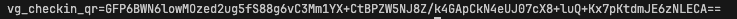
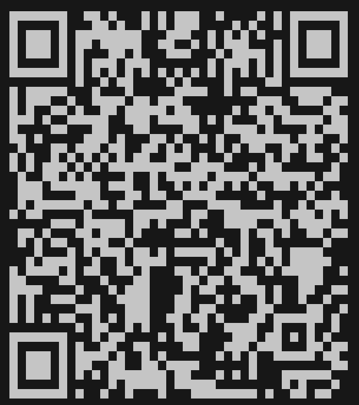
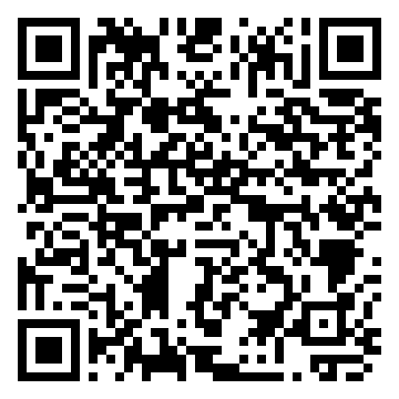

# Disclaimer
This repository is a small tool built for experimenting with Virtuagym QR payloads. Use it only where you have permission. The code is provided for research and security-hardening purposes.

# Examples
Below are example outputs generated by the script (images are in the `examples/` directory):

- **Raw payload (console raw):**

  

- **Console/terminal output screenshot:**

  

- **Saved QR image:**

  


# How to run
Login into your gym's website using the virtuagym software, in my case, ``https://<your gym slug>.virtuagym.com/``
You can likely find this URL by looking for a login option inside your gym landing page or password recovery in-app.

## Where the parameters come from

**Recommended: pull them from an existing real QR code instead of guessing from cookies.**
If you can get your hands on a check-in QR the app itself already generated for you
(screenshot it, or save the image), the most reliable way to get all three parameters at
once is to decrypt it with ``read.py``:

```bash
python3 read.py --image path/to/real_qr.png
```

Leaving out `--superclub_id` makes `read.py` brute-force it automatically (see
"Reading a QR back" below), and the same run prints out `vg_member_id` and `club_member_id`
straight from the decrypted payload — no need to reconcile cookies against JS config values.

If you don't have a real QR to work from yet, the cookies alone (``virtuagym_u``,
``virtuagym_pref_club``) are **not** reliable sources for these values — they identify your
account and preferred club, not necessarily the IDs the check-in QR encryption actually
uses. Confirmed sources, from the page's own embedded JS config (view-source on the club
homepage while logged in, e.g. `window.vg_auth_config`):

- ``--vg_member_id`` → `window.vg_auth_config.currentMemberId` (also present as
  `web_apps_base_club_data.member.id`). This is your **membership ID at that specific club**,
  which is a different number from the `virtuagym_u` cookie / `currentUserId` (your
  account-level user ID).
- ``--superclub_id`` → **not** `window.vg_auth_config.clubId` / the `virtuagym_pref_club`
  cookie. That value is the plain `club_id` for the specific location, but the AES key
  derivation needs the parent chain/"superclub" ID, which is a different number not embedded
  in the homepage HTML in the cases tested so far (the page only exposes booleans
  `club_has_superclub` / `club_is_superclub`, not the ID itself). The most reliable way to get
  it is to capture a real check-in QR from the app (screenshot or save the image) and recover
  it with ``read.py`` — see below — since the correct `superclub_id` is whichever value
  successfully decrypts a real QR back into a sane `timestamp`/`vg_member_id`.
- ``--club_member_id`` (optional) — not confirmed from any tested payload so far (real QR
  codes generated in testing didn't include it). It might show up at
  ``https://<your gym slug>.virtuagym.com/user/<your account slug>/settings/sportschool``.

Then run the script with:
```
python3 gen.py --vg_member_id <MEMBER_ID> --superclub_id <SUPERCLUB_ID>
```

if this doesn't work, try
```
python3 gen.py --vg_member_id <MEMBER_ID> --superclub_id <SUPERCLUB_ID> --club_member_id <CLUB_MEMBER_ID>
```

# Installation

Install the Python dependencies (recommended in a virtualenv):

```bash
pip3 install -r requirements.txt
```

# Options
By default, it shows the raw QR code data in console, but you can use:
- `--qr` : Render the generated final string as an ASCII QR code in the terminal.
- `--qr-image <path>` : Save a PNG image of the QR code to `<path>`.

Both options can be combined; for example the command below prints an ASCII QR and writes `out.png`:

```bash
python3 gen.py --vg_member_id <MEMBER_ID> --superclub_id <SUPERCLUB_ID> --club_member_id <CLUB_MEMBER_ID> --qr --qr-image out.png
```

# Output
The script prints a string like:

```
vg_checkin_qr=<base64...>
```

When `--qr` (console output) or `--qr-image` (outputs png to the specified path) are used that full string is encoded into the QR value.

# Reading a QR back (`read.py`)

`read.py` decrypts a check-in QR — either from an image file or from a raw string — and
prints out the `timestamp`, `vg_member_id`, and `club_member_id` embedded in it.

```bash
# From a saved/screenshotted QR code image:
python3 read.py --image path/to/qr.png --superclub_id <SUPERCLUB_ID>

# From a raw string (with or without the "vg_checkin_qr=" prefix; quote it, it contains / and +):
python3 read.py --string "vg_checkin_qr=<base64...>" --superclub_id <SUPERCLUB_ID>
```

If you don't know `superclub_id` (e.g. it isn't in the homepage HTML — see above), omit the
flag and `read.py` will brute-force it by trying every value from `0` up to
`--brute_force_max` (default `200000`) until one produces valid PKCS5 padding and a
parseable JSON payload — this is exactly how `61048` was recovered for a real captured QR
during testing, and it completes in well under a second:

```bash
python3 read.py --string "vg_checkin_qr=<base64...>"
```

Note: the AES IV used at generation time is random and never transmitted with the QR, but
in AES-CBC the IV only affects decryption of the *first* ciphertext block — which is always
the random 16-character prefix that `gen.py` prepends to the payload before encrypting, and
is discarded anyway. So `read.py` can decrypt the real JSON (blocks 2+) correctly even
without knowing the original IV.

# Notes
- The QR payload is produced by encrypting a small JSON payload; the resulting value is prefixed with `vg_checkin_qr=`.
